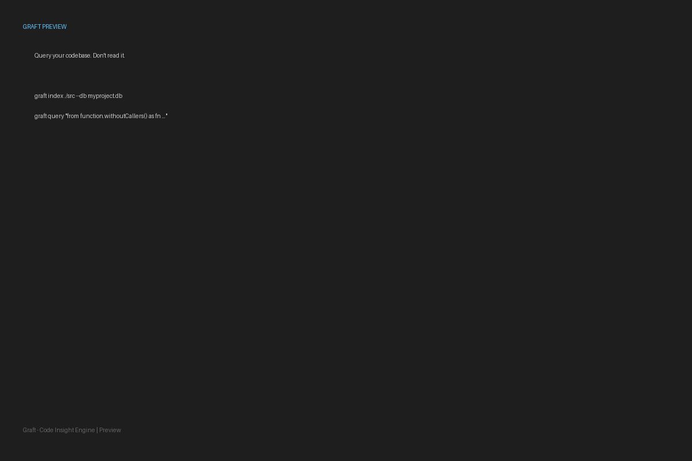

# Graft

> **Preview / Alpha** — Python only. API may change. Install from source. Feedback and issues very welcome.

**Query your codebase. Don't read it.**



---

## Install (Preview)

```bash
git clone https://github.com/oliver021/graft-ql.git
cd graft-ql
pip install -e .
```

Then point it at any Python codebase:

```bash
graft index ./src --db sqlite:///index.db
graft query "from function.withoutCallers() as fn select fn.name, fn.filename" --db sqlite:///index.db
```

```
name            | filename
----------------+---------------------
_legacy_parse   | src/parser/old.py
_unused_handler | src/server/routes.py
(2 rows) — 4ms
```

> Python 3.10+. SQLite included. No accounts, no cloud, no rate limits.

---

## The Problem

AI-generated code is outpacing human reading speed.

A developer can scaffold a service in minutes with an LLM. A team can generate thousands of lines before anyone has fully read them. An agent can write, refactor, and extend code across dozens of files in a single session — and no one has a complete mental model of what was built.

Reading code is slow. It doesn't scale. And it's not how codebases are being created anymore.

Graft exists to close that gap. It gives both **humans and agents** a structured, token-efficient way to navigate code they didn't fully read while it was being written.

---

## What It Does

Graft indexes your source code into a queryable database, then exposes it through a purpose-built query language — **GQL (Graft Query Language)**.

```bash
# Index a directory
graft index ./src

# Ask a structural question
graft query "from function.calls as c where c.name = 'eval' select c.enclosing, c.filename, c.start"
```

```
enclosing       | filename           | start
----------------+--------------------+------
process_input   | src/handlers.py    | 47
run_template    | src/renderer.py    | 112
(2 rows) — 3ms
```

You didn't read those files. You didn't need to.

---

## Why This Design

Every decision in Graft serves one constraint: **maximum insight, minimum context consumed.**

### Pure, stateless `scan()`
The indexer produces structured rows — no side effects, no implicit state. Every file scan is reproducible from its source text alone. Agents can call it without managing context about what was previously scanned.

### Structured `QueryResult`
Results come back as typed rows with column names, row count, elapsed time, and the exact SQL that ran. No scraping. No parsing. No ambiguity about what the tool found. An agent reading a `QueryResult` spends zero tokens on format uncertainty.

### Composable GQL
The query language was designed for the question humans and agents actually ask: *"What is this thing doing, and what touches it?"* Three clauses: `from`, `where`, `select`. Entity traversal is first-class:

```sql
-- Everything that calls open() in the codebase
from function.calls as c where c.name = "open" select c.enclosing, c.filename

-- Dead code: functions defined but never called
from function.withoutCallers() as fn select fn.name, fn.filename

-- Complexity signals: deep call chains
from function.callDepth() as fn where fn.depth > 5 select fn.name, fn.depth
```

### Transparent SQL
Every result exposes the SQL it ran. You can verify, learn, or debug without opening a black box. Graft never hides what it did.

### Token efficiency
A `QueryResult` for 50 matching functions is a compact table. The equivalent would be 50 source files passed to a context window. Graft answers the question without consuming the evidence.

---

## Core Use Cases

**Onboarding to an unfamiliar repo**
```sql
from class.methods as m select m.className, m.name, m.start, m.filename
from file.imports as i select i.filename, i.module
```

**Security and risk audit**
```sql
from function.calls as c
where c.name like "eval" or c.name like "exec" or c.name like "subprocess"
select c.enclosing, c.filename, c.start
```

**Refactor planning**
```sql
-- Fat classes
from class.methods as m select m.className, m.filename

-- Functions that never get called
from function.withoutCallers() as fn select fn.name, fn.filename

-- Everything a function touches
from function.callees as fn where fn.name = "process" select fn.name, fn.filename
```

**Understanding AI-generated code**
```sql
-- What did the agent actually build?
from function as fn select fn.name, fn.paramCount, fn.filename, fn.start

-- Does it throw exceptions? Where?
from function.getDoesThrow() as fn select fn.name, fn.filename
```

---

## Architecture

```
┌─────────────────────────────────────────────────────────────┐
│                         Graft                               │
├──────────────┬───────────────┬────────────┬─────────────────┤
│ code_indexer │  graft_parser │graft_engine│  graft_server   │
│              │               │            │                 │
│  tree-sitter │ Lark grammar  │  SA Core   │  FastAPI        │
│  → SQL rows  │  → Query AST  │ AST → SQL  │  REST + CLI     │
└──────────────┴───────────────┴────────────┴─────────────────┘
                                    │
                             SQLite / Postgres
```

**Dependency rules (never violated):**
- `code_indexer` — writes only. No query logic.
- `graft_parser` — pure Python. No DB, no imports outside stdlib.
- `graft_engine` — reads schema, consumes AST, produces results.
- `graft_server` — thin wrapper. No business logic.

---

## Current Status

| Module | Status | Tests |
|---|---|---|
| `code_indexer` | ✅ Complete | 73 passing |
| `graft_parser` | ✅ Complete | 73 passing |
| `graft_engine/entity_registry` | ✅ Complete | 85 passing |
| `graft_engine/compiler` | ✅ Complete | 97 passing |
| `graft_engine/executor` | ✅ Complete | 53 passing |
| `graft_server` | ✅ Minimal | — |
| CLI (`graft`) | ✅ Minimal | — |

**Total: 554 passing tests.** Language support: **Python only in v1** (JavaScript/TypeScript on the roadmap). DB: SQLite (Postgres-ready schema).

---

## Quickstart

### 1. Install

```bash
git clone https://github.com/YOUR_USERNAME/graft-ql.git
cd graft-ql
pip install -e .
```

### 2. Index a codebase

```bash
graft index ./your-project --db sqlite:///myproject.db
```

### 3. Ask questions

```bash
# Dead code — functions defined but never called
graft query "from function.withoutCallers() as fn select fn.name, fn.filename" --db sqlite:///myproject.db

# Risk surface — calls to eval/exec
graft query 'from function.calls as c where c.name like "eval" select c.enclosing, c.filename, c.start' --db sqlite:///myproject.db

# Complexity hotspots — deep call chains
graft query "from function.callDepth() as fn where fn.depth > 4 select fn.name, fn.depth, fn.filename" --db sqlite:///myproject.db

# All functions that raise exceptions
graft query "from function.getDoesThrow() as fn select fn.name, fn.filename" --db sqlite:///myproject.db
```

### 4. Run saved queries from `.gql` files

```bash
graft query --file examples/dead_code.gql --db sqlite:///myproject.db
graft query --file examples/risky_calls.gql --db sqlite:///myproject.db --format json
```

### 5. Get results as JSON or CSV

```bash
graft query "from function as fn select fn.name, fn.filename" --db sqlite:///myproject.db --format json
graft query "from function as fn select fn.name, fn.filename" --db sqlite:///myproject.db --format csv
```

### 6. Start the HTTP server

```bash
graft serve --db sqlite:///myproject.db
```

```bash
curl -s -X POST http://127.0.0.1:8000/query \
  -H "Content-Type: application/json" \
  -d '{"query": "from function as fn select fn.name, fn.filename", "format": "json"}' \
  | python -m json.tool
```

### 7. Run the self-contained demo

```bash
python e2e_demo.py
```

---

## GQL Reference

```sql
-- Basic form
from <entity-path> as <alias>
[where <condition>]
select <fields>

-- Root entities
function   -- functions and methods
class      -- class definitions
file       -- source files
expression -- any expression (call, import, assignment, ...)

-- Traversals (change entity context)
function.calls        -- call expressions inside functions
function.callers      -- functions that call this function
function.callees      -- functions called by this function
function.callDepth()  -- recursive call chain depth
class.methods         -- methods belonging to a class
file.imports          -- import statements in a file
file.functions        -- functions defined in a file

-- Predicates (filter, same entity)
function.withoutArgs()     -- no parameters
function.getDoesThrow()    -- contains raise statement
function.withoutCallers()  -- never called
function.calls("name")     -- calls a specific function
```

---

## Roadmap

- [ ] JavaScript / TypeScript support
- [ ] `graft watch` — re-index on file change
- [ ] Aggregate queries (`count`, `group by`)
- [ ] Cross-file reference resolution pass
- [ ] VS Code extension
- [ ] Agent SDK (structured result types, query builder API)

---

## Name

Graft. Trees have structure. You graft a query language onto that structure.

Code never leaves your machine.

---

*Built for developers and agents navigating codebases faster than they can be read.*
